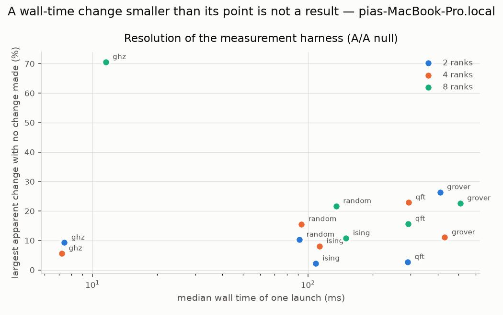
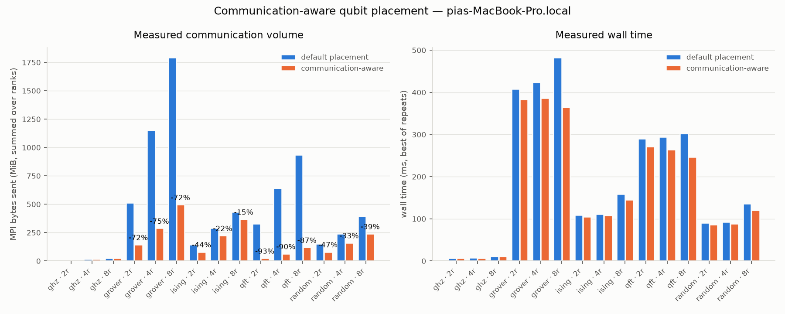
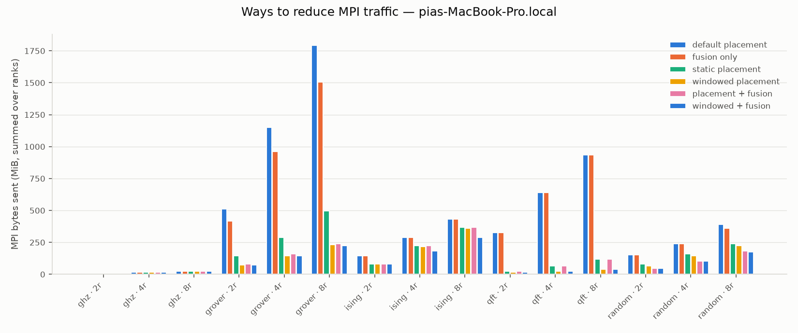
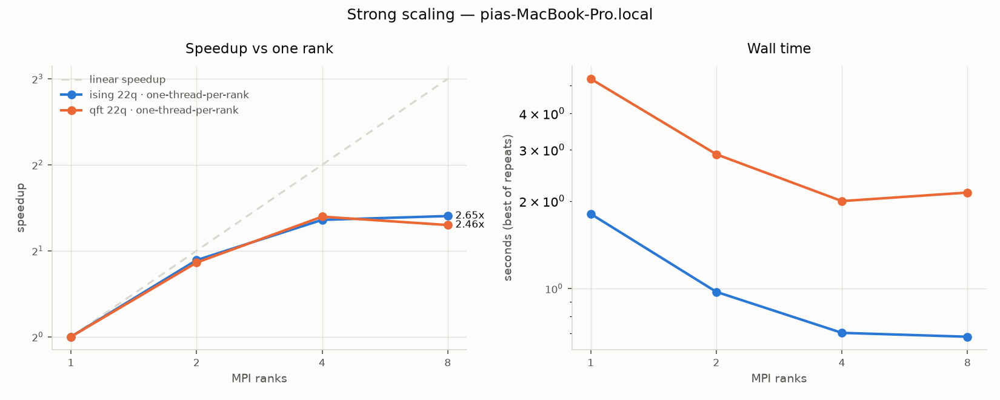
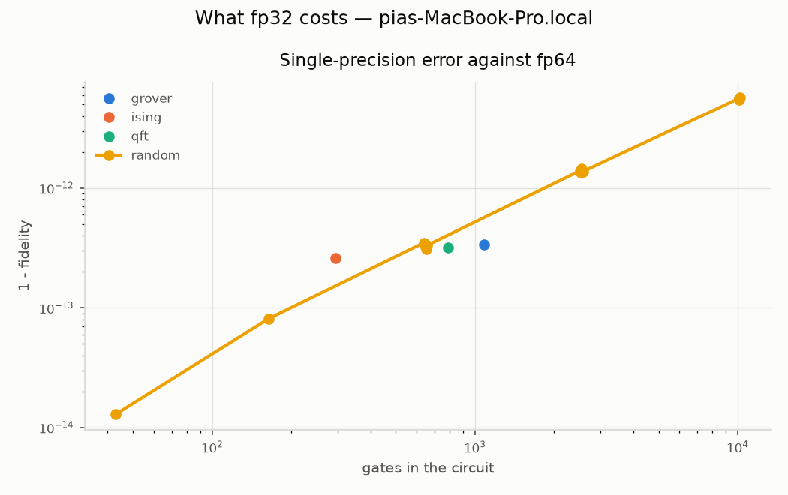
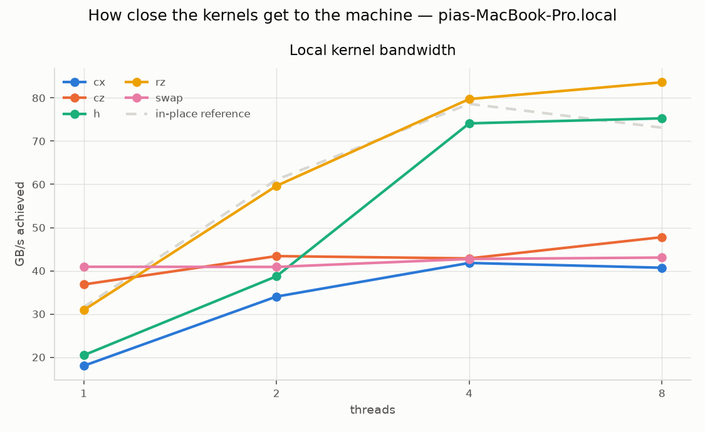
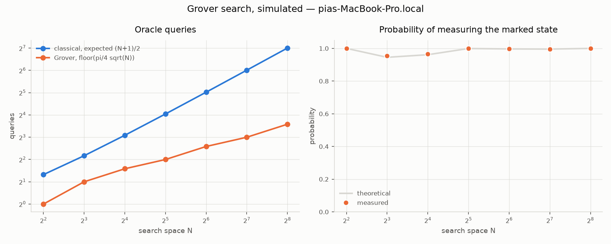

# AegisQ-HPC

**Post-Quantum Secure, Communication-Aware Distributed Quantum Simulation for HPC Clusters**


A distributed quantum state-vector simulator that partitions the state across
MPI ranks, **chooses the qubit-to-rank placement deliberately instead of by
accident**, measures every byte it sends, and protects job submission and
result provenance with NIST-standardised post-quantum cryptography.

The simulator is written from scratch in C++20 with MPI and OpenMP. Qiskit is
used **only** as a correctness oracle in the test suite — never by the
runtime, and never as a performance baseline (no simulator-versus-simulator
comparison is made here; see [docs/limitations.md](docs/limitations.md)).

<!-- HEADLINE:START -->

> **Headline result.** On 8 ranks at 20 qubits, communication-aware placement removed **87.2% of measured MPI traffic** for a quantum Fourier transform and 72.3% for Grover -- and left a GHZ chain untouched, because nothing there can be improved. The analytical cost model predicted the byte count *exactly* in every one of 99 distributed configurations measured.
> **Wall time follows, but only once the clock is calibrated.** Launching the *same* configuration twice, 10 times over, produces apparent changes of up to 71% with nothing changed between the runs -- larger than most of the effects being looked for. Measured against a floor built from that null, all 12 configurations whose traffic actually changed show a resolved reduction in wall time, and all 3 controls, whose traffic the optimiser leaves identical, do not.
> [Full numbers below](#measured-results), from raw data in [`benchmarks/raw/`](benchmarks/raw/).

<!-- HEADLINE:END -->

```
     circuit ──► communication cost model ──► qubit placement search
                                                      │
        .aqjob  (ML-KEM-768 + ML-DSA-65 + AES-256-GCM)│
           │                                          ▼
           └─► verify ─► decrypt ─► ┌──────────── distributed runtime ────────────┐
                                    │ rank 0    rank 1    rank 2    rank 3        │
                                    │ shard     shard     shard     shard         │
                                    │      ↔ instrumented MPI exchange ↔          │
                                    └──────────────────┬──────────────────────────┘
                                                       ▼
                             .aqresult  (Merkle root + ML-DSA signature + metrics)
```

## What is implemented

| Area | Capability |
|---|---|
| Simulation | distributed state vector over MPI, OpenMP local kernels, fp64/fp32, twelve gates, terminal measurement |
| Placement | gate-role-aware cost model in bytes, exhaustive or heuristic search, applied by the runtime |
| Fusion | consecutive single-qubit runs multiplied into one unitary, exact including global phase, never increasing communication |
| Windowed placement | the assignment may change mid-circuit when the saving exceeds the cost of moving, planned by dynamic programming and executed as a circuit rewrite |
| Instrumentation | every MPI transfer timed and counted, per opcode, rank-local and world-reduced |
| Security | ML-KEM-768 / ML-DSA-65 job envelopes, replay protection, signed Merkle-committed results |
| Algorithms | GHZ, QFT, Trotterised Ising, Grover, Shor (factors 15 and 21), random circuits |
| Measurement | reproducible sweeps writing raw CSV; every figure and table derived from it, including kernel bandwidth against a machine reference |
| Validation | every distributed kernel checked against a single-process reference at 1/2/4/8 ranks, plus 100 randomised Qiskit comparisons per run |

## Research questions

| | Question |
|---|---|
| **RQ1** | Can communication-aware qubit placement reduce MPI communication volume and wall-clock time for distributed state-vector simulation? |
| **RQ2** | What overhead does authenticating and encrypting HPC quantum jobs and results with standardised post-quantum cryptography introduce? |
| **RQ3** | How do small Grover and Shor experiments illustrate the cryptographic motivation for post-quantum cryptography? |

## Why the state vector must be distributed

An `n`-qubit state vector holds `2^n` complex amplitudes. In double precision
each amplitude costs 16 bytes:

| Qubits | State size (fp64) |
|---:|---:|
| 26 | 1 GiB |
| 30 | 16 GiB |
| 32 | 64 GiB |
| 40 | 16 TiB |

Beyond a single machine's memory the state must be partitioned, and
partitioning turns some quantum gates into network operations. Which gates
those are depends on the qubit-to-rank mapping — and that is the optimisation
problem at the centre of this project.

## Quick start

```bash
git clone https://github.com/0xpinara/AegisQ-HPC.git
cd AegisQ-HPC

python3 -m venv .venv && source .venv/bin/activate
pip install -e ".[dev,crypto,benchmark,validation]"

make build      # configure + compile the C++20 core and Python extension
make test       # C++ unit tests and single-process Python tests
aegisq doctor   # report MPI / OpenMP / liboqs / Qiskit availability
```

### Requirements

| Component | Purpose | Required |
|---|---|---|
| C++20 compiler, CMake ≥ 3.24 | native simulation core | yes |
| Python 3.11+, NumPy | front end, reference backend | yes |
| MPI (OpenMPI or MPICH) | distributed runtime | for multi-rank execution |
| OpenMP | threaded local kernels | optional |
| liboqs-python | ML-KEM-768 / ML-DSA-65 | for the secure job layer |
| Qiskit | correctness oracle in tests | optional |
| CUDA | experimental GPU work | optional, not required |

## Measured results

<!-- BENCHMARK-RESULTS:START -->

All figures below were measured on **Apple M2 (8 logical cores)**, macOS-15.6.1-arm64-arm-64bit, Open MPI v5.0.10, AegisQ 0.1.0 at commit `60780a80765f`. They describe that host and are not a claim about cluster hardware.

> Some rows were recorded from a working tree with uncommitted changes, so they cannot be attributed to a commit with confidence. Re-run `./scripts/benchmark_local.sh` from a clean tree to replace them.

### What this harness can actually resolve

Every wall-time number below is judged against this table, so it comes first. Each configuration was launched twice, 10 times over, with **nothing changed between the two runs**. Every difference in this table is therefore zero by construction, and everything reported is the instrument, not the simulator.

| circuit | ranks | median run | median apparent change | worst | resolution |
|---|---:|---:|---:|---:|---:|
| ghz | 2 | 7 ms | 4.8% | 9.3% | **9.3%** |
| grover | 2 | 410 ms | 4.2% | 26.4% | **26.4%** |
| ising | 2 | 109 ms | 0.4% | 2.2% | **2.2%** |
| qft | 2 | 290 ms | 0.8% | 2.7% | **2.7%** |
| random | 2 | 91 ms | 1.3% | 10.3% | **10.3%** |
| ghz | 4 | 7 ms | 1.3% | 5.6% | **5.6%** |
| grover | 4 | 431 ms | 1.7% | 11.1% | **11.1%** |
| ising | 4 | 113 ms | 0.6% | 8.1% | **8.1%** |
| qft | 4 | 293 ms | 1.9% | 22.9% | **22.9%** |
| random | 4 | 93 ms | 3.5% | 15.6% | **15.6%** |
| ghz | 8 | 12 ms | 9.2% | 70.6% | **70.6%** |
| grover | 8 | 509 ms | 13.5% | 22.6% | **22.6%** |
| ising | 8 | 150 ms | 5.0% | 10.8% | **10.8%** |
| qft | 8 | 292 ms | 3.4% | 15.7% | **15.7%** |
| random | 8 | 135 ms | 8.8% | 21.7% | **21.7%** |

`resolution` is the quantile of the apparent change at `1 - 1/(trials+1)`, so an effect exceeding it carries `p <= 0.09` under exchangeability. The relationship worth noting is with duration, not with rank count: a GHZ chain finishing in under ten milliseconds cannot be timed to better than tens of percent, while a Grover circuit running for half a second can. This is a laptop with four performance and four efficiency cores and no separate interconnect, and the distribution of launch times is right-skewed -- interference makes a run slower, never faster.

That one-sidedness says which estimator to use. Taking the minimum over several independent launches, rather than over repeats inside one, converges on the uncontended runtime; resampling the null above puts the median resolution at **11%** at 1 launch, **6%** at 3 launches, **2%** at 5 launches. `aegisq benchmark mapping --launches N` runs the sweep that way.



### Communication-aware placement, 8 ranks, 20 qubits

| circuit | measured MPI bytes, default | measured MPI bytes, optimized | reduction | wall time change |
|---|---:|---:|---:|---:|
| qft | 981,467,136 | 125,829,120 | **87.2%** | -18.6% |
| grover | 1,879,048,192 | 520,093,696 | **72.3%** | -24.4% |
| random | 411,041,792 | 251,658,240 | **38.8%** | -11.5% |
| ising | 452,984,832 | 385,875,968 | **14.8%** | -9.1% |
| ghz | 25,165,824 | 25,165,824 | **0.0%** | +0.1% (unresolved) |

Byte counts are exact counters; wall times are not. Every wall-time change here is judged against a floor measured for that exact configuration, and is marked unresolved unless it clears it. Across all rank counts, 12 of 12 configurations where the optimiser actually changed the traffic clear their floor, and 3 of 3 controls -- where it provably did not -- do not. The controls not clearing their own floors is the check that the floors are wide enough.

A second, assumption-light check points the same way: all 12 of them moved in the same direction. Under a null that each configuration's sign is a coin flip, that is `p = 2^-12`. Direction is a much cheaper thing to measure than magnitude, and it is the part worth trusting.

Not every circuit benefits: ghz shows no reduction, because its expensive qubits already sit well under the default placement. That is a result, not a gap — a heuristic that claimed a win on every circuit would be the suspicious one.



### Three ways to spend less on the network

Placement decides *which* gates communicate. Fusion decides *how many times*. Windowed placement changes the assignment part-way through the circuit, when the phase structure makes the switch worth paying for. Measured at 8 ranks:

| circuit | baseline MPI bytes | fusion | static placement | windowed placement | placement + fusion | everything |
|---|---:|---:|---:|---:|---:|---:|
| qft | 981,467,136 | 0.0% | 87.2% | **95.7%** | 87.2% | **95.7%** |
| grover | 1,879,048,192 | 16.1% | 72.3% | 87.1% | 86.6% | **87.5%** |
| random | 411,041,792 | 8.2% | 38.8% | 42.9% | 53.1% | **55.1%** |
| ising | 452,984,832 | 0.0% | 14.8% | 16.7% | 14.8% | **33.3%** |
| ghz | 25,165,824 | 0.0% | 0.0% | 0.0% | 0.0% | 0.0% |

Windowed placement beats the best single assignment on 4 of 5 circuits — for `qft`, 95.7% against 87.2% — by paying a few shard exchanges to re-assign qubits between phases. Where a circuit has no phase structure the planner declines to switch and the two coincide.

Applying all three together is worth more than the best of them alone. For `ising` the combination removes 33.3% where the best single lever removes 16.7% — the levers change each other's cost landscape rather than dividing the same saving between them.

Placement and fusion are not independent either: for `random` the pair removes 53.1% where separately they remove 8.2% and 38.8%. Fusing first changes which placement is best, so the search finds a better one.



### Strong scaling (one thread per rank)

| circuit | qubits | ranks | wall time (s) | speedup | efficiency |
|---|---:|---:|---:|---:|---:|
| ising | 22 | 1 | 1.806 | 1.00x | 100% |
| ising | 22 | 2 | 0.974 | 1.85x | 93% |
| ising | 22 | 4 | 0.704 | 2.57x | 64% |
| ising | 22 | 8 | 0.682 | 2.65x | 33% |
| qft | 22 | 1 | 5.260 | 1.00x | 100% |
| qft | 22 | 2 | 2.894 | 1.82x | 91% |
| qft | 22 | 4 | 1.998 | 2.63x | 66% |
| qft | 22 | 8 | 2.137 | 2.46x | 31% |



### Is the fallback search good enough?

The placement search is exhaustive while the candidate count fits a budget and falls back beyond it. Two facts make the fallback safer than "not guaranteed optimal" suggests.

Every cost rule except `swap` depends on one qubit's membership: a single-qubit gate costs if *its* qubit is global, a `cx` costs if *its target* is. `swap` costs if *either* operand is, and an OR is not a sum. So for a circuit without `swap` gates the objective is linear in the global set, and sorting the per-qubit costs gives the optimum outright — no search.

For the rest, measured: across 99 sampled configurations, 93 of which genuinely needed the heuristic, it matched the exhaustive optimum **99 times out of 99** (worst gap 0.00%) while running up to 41x faster.

### A fourth lever, and what it costs

Single precision halves the shard and halves every transfer, exactly and without any analysis — unlike the other three levers, there is nothing to search for. The question is only what the accuracy costs.

| circuit | gates | 1 − fidelity | largest amplitude error |
|---|---:|---:|---:|
| random | 43 | 1.3e-14 | 7.5e-08 |
| random | 164 | 8.1e-14 | 6.7e-08 |
| ising | 294 | 2.6e-13 | 7.1e-08 |
| random | 639 | 3.5e-13 | 9.9e-09 |
| random | 643 | 3.3e-13 | 9.2e-09 |
| random | 654 | 3.1e-13 | 7.5e-09 |
| random | 656 | 3.3e-13 | 7.2e-09 |
| qft | 792 | 3.2e-13 | 1.2e-08 |
| grover | 1,082 | 3.4e-13 | 1.5e-06 |
| random | 2,510 | 1.4e-12 | 3.1e-08 |
| random | 2,527 | 1.3e-12 | 3.0e-08 |
| random | 2,533 | 1.3e-12 | 3.4e-08 |
| random | 2,553 | 1.5e-12 | 3.4e-08 |
| random | 2,577 | 1.4e-12 | 3.2e-08 |
| random | 10,141 | 5.6e-12 | 1.2e-07 |
| random | 10,151 | 5.6e-12 | 1.1e-07 |
| random | 10,159 | 5.5e-12 | 1.1e-07 |
| random | 10,198 | 5.7e-12 | 1.3e-07 |

The error grows with circuit size — the largest circuit measured (10,198 gates) loses 5.7e-12 of fidelity — so "fp32 is fine" is a statement about a depth, not about a precision. In this range it is very fine: distinguishing the worst case here from the exact state would take on the order of 2e+11 shots, against the thousands a real job takes.



### Are the local kernels any good?

Wall time alone cannot say. State-vector simulation is bandwidth-bound, so each kernel is compared against what the same machine achieves on an in-place scale of the same array — same type, same flags, same threading. At 8 threads:

| kernel | GB/s achieved | reference | fraction |
|---|---:|---:|---:|
| rz | 83.6 | 73.1 | 114% |
| h | 75.3 | 73.1 | 103% |
| cz | 47.8 | 73.1 | 65% |
| swap | 43.1 | 73.1 | 59% |
| cx | 40.7 | 73.1 | 56% |

The kernels that sweep the whole state — a general single-qubit gate and a diagonal one — run at 103–114% of that reference, which is to say they are memory-bound and there is little left to win. The ones that touch only part of the state plateau near 60%: they read and write a strided fraction of the array and leave about half the bandwidth unused. That is a concrete optimisation target rather than a mystery.

The communication cost model assumes only the local/global distinction matters, never which *local* position a qubit occupies. Measured, that holds for most kernels (`cx` varies by 1% across target positions) and fails for `cz`, which varies by 48%. The model is therefore right about network traffic and incomplete about local cost — stated here rather than left for a reader to discover.



### Cost of the post-quantum layer

| operation | median | size |
|---|---:|---:|
| ML-DSA-65 keygen | 53.7 us | 1952 B |
| ML-DSA-65 sign | 94.6 us | 3309 B |
| ML-DSA-65 verify | 49.5 us | 3309 B |
| ML-KEM-768 decapsulate | 20.0 us | 32 B |
| ML-KEM-768 encapsulate | 17.5 us | 1088 B |
| ML-KEM-768 keygen | 16.8 us | 1184 B |
| pack a job bundle (end to end) | 3.0 ms | — |
| verify, decrypt and open it | 5.5 ms | — |
| envelope overhead, independent of circuit size | — | 7083 B |

For scale: the heaviest job measured here (grover, 20 qubits, 8 ranks) runs for 482 ms and moves 1792 MiB over MPI. Securing it costs 8.5 ms end to end and 6.9 KiB on the wire — 1.76% of the runtime. Only 182 us of that is lattice arithmetic; the rest is canonical serialisation and base64, which is where an optimisation would actually pay off.

### Why post-quantum cryptography, in one table

| search space | Grover oracle queries | classical expected | measured success |
|---:|---:|---:|---:|
| 4 | 1 | 2.5 | 100.0% |
| 8 | 2 | 4.5 | 95.4% |
| 16 | 3 | 8.5 | 96.6% |
| 32 | 4 | 16.5 | 99.9% |
| 64 | 6 | 32.5 | 99.7% |
| 128 | 8 | 64.5 | 99.6% |
| 256 | 12 | 128.5 | 100.0% |

Every row is a simulated run, not a formula: searching 256 items took 12 oracle queries where classical search averages 128.5, and the marked state was measured 100.0% of the time. That quadratic factor is why post-quantum guidance doubles symmetric key sizes rather than abandoning them — while Shor's exponential advantage is why RSA and elliptic curves are replaced outright.



### Cost model versus reality

In all **99 of 99** distributed configurations measured here, the runtime sent exactly the number of bytes the analytical cost model predicted.

Raw measurements: [`benchmarks/raw/`](benchmarks/raw/) · derived tables: [`benchmarks/processed/`](benchmarks/processed/) · methodology: [`docs/benchmark-methodology.md`](docs/benchmark-methodology.md)

<!-- BENCHMARK-RESULTS:END -->

## Running a circuit

```bash
# single process
aegisq run examples/bell.qasm --shots 1000

# distributed over four ranks
mpirun -np 4 aegisq run examples/ghz8.qasm --shots 1000

# with a communication-aware placement
mpirun -np 8 aegisq run qft --qubits 24 --shots 1024 --optimize

# what would a placement cost?
aegisq optimize random --qubits 20 --ranks 8 --option seed=3

# will it fit?
aegisq estimate --qubits 30 --ranks 4 --precision fp64
```

### Secure job submission

```bash
# once per identity
aegisq keys init-client pinar --directory keys
aegisq keys init-cluster courant --directory keys

# client side: encrypt to the cluster, sign with your key
aegisq secure-pack qft --qubits 24 --identity keys/pinar \
    --cluster keys/courant --ranks 8 --shots 1024 --output qft24.aqjob

# cluster side: verify, decrypt, run, sign the result
mpirun -np 8 aegisq secure-run qft24.aqjob --cluster keys/courant \
    --trusted keys/trusted --output qft24.aqresult

# anyone: check the signed execution record
aegisq verify-result qft24.aqresult --cluster keys/courant
```

An identity is named by its stem, as `keys init-*` prints it. The full
filename of either half (`keys/courant.public.json`,
`keys/courant.secret.json`) is accepted too and resolves to whichever half
the command needs -- naming the secret file where a public key is wanted
reads the public one, never the secret.

Circuit input is a **documented subset** of OpenQASM (single register, the
twelve supported gates, terminal measurement); anything outside it is rejected
with a line number rather than ignored. The grammar is in
[docs/architecture.md](docs/architecture.md).

## Repository layout

```
cpp/          C++20 simulation core, MPI runtime, pybind11 bindings
aegisq/       Python package: circuits, runtime, compiler, secure, provenance
tests/        unit, integration, MPI, crypto and cross-validation suites
benchmarks/   raw measurements, processed tables, generated plots
docs/         architecture, algorithms, protocol and methodology notes
paper/        technical report sources
slurm/        cluster job scripts
```

## Documentation

| Document | Contents |
|---|---|
| [architecture.md](docs/architecture.md) | layer responsibilities, native core layout, OpenQASM subset |
| [simulator-theory.md](docs/simulator-theory.md) | state-vector conventions, gate set, why measurement is terminal |
| [distributed-algorithm.md](docs/distributed-algorithm.md) | partitioning, which gates communicate and how much |
| [optimizer.md](docs/optimizer.md) | cost model, search strategy, what the model cannot see |
| [pqc-protocol.md](docs/pqc-protocol.md) | envelope format, canonical bytes, result bundles |
| [security-model.md](docs/security-model.md) | assets, adversaries, exclusions, what a signature proves |
| [benchmark-methodology.md](docs/benchmark-methodology.md) | what is counted, thread policies, statistics |
| [reproducibility.md](docs/reproducibility.md) | what is deterministic and what is not |
| [limitations.md](docs/limitations.md) | every constraint of this implementation, in one place |
| [paper/main.tex](paper/main.tex) | technical report; tables are generated from the measured data |

## Scope and honesty statement

AegisQ-HPC is a research prototype, not a production security product.

- Post-quantum primitives come from [liboqs](https://openquantumsafe.org/);
  no cryptography is invented here.
- A signed execution record authenticates origin and detects tampering. It is
  **not** a proof that a computation was performed correctly.
- The Grover and Shor demonstrations run at educational problem sizes and make
  no claim about cryptographically relevant key or modulus sizes.
- No quantum advantage is claimed anywhere in this repository.
- All measurements come from one laptop with shared-memory MPI; see
  [docs/limitations.md](docs/limitations.md) for what that does and does not
  support.

## Licence

MIT — see [LICENSE](LICENSE).
